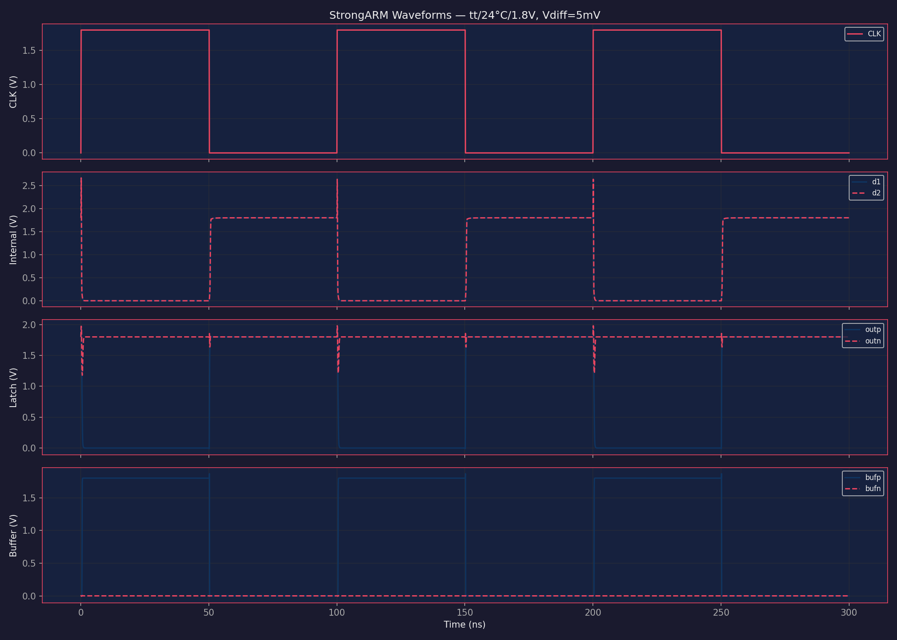
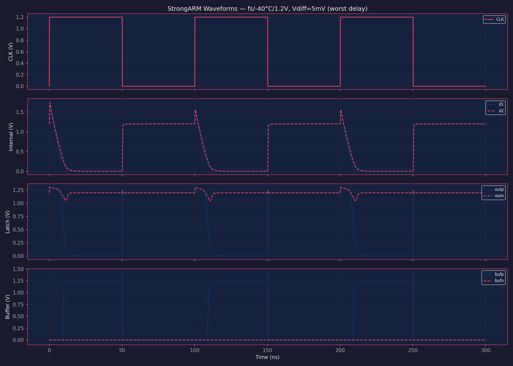
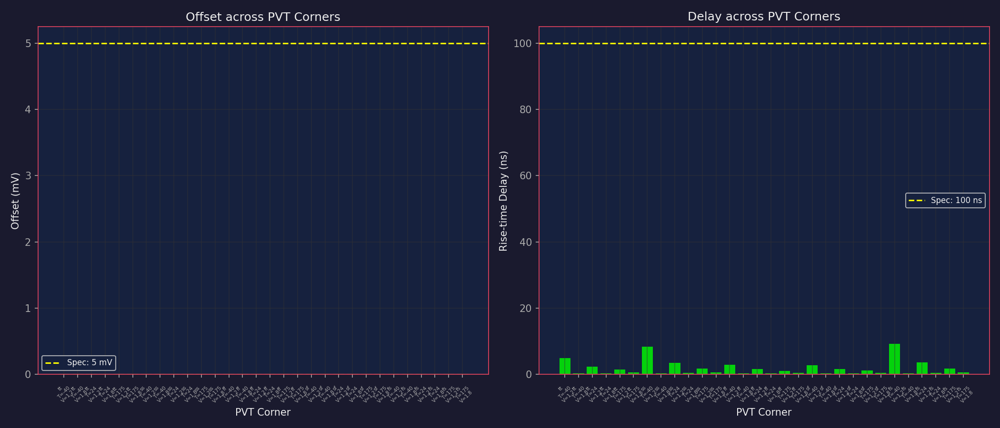
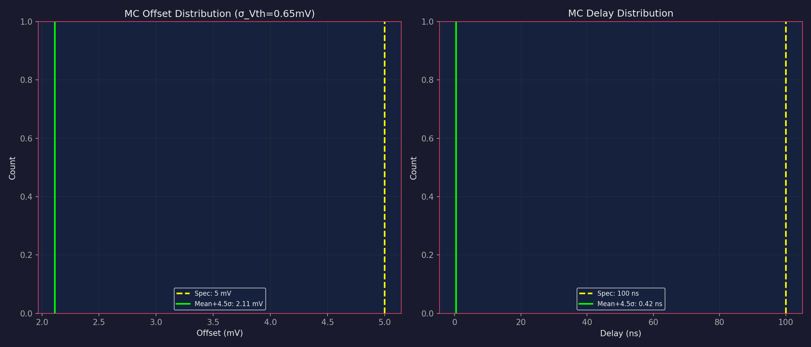

# SKY130 StrongARM Comparator — Autonomous Design

> **Status: VALIDATED — Score 1.00/1.00, all specs met with healthy margin.**

## Overview

StrongARM latch comparator in SkyWater SKY130 (130nm) technology, designed and validated across all PVT corners and Monte Carlo mismatch.

| Spec | Target | Worst-Case Result | Margin | Status |
|------|--------|-------------------|--------|--------|
| Input-referred offset | < 5 mV | 2.11 mV (MC 4.5σ) | 57.7% | **PASS** |
| Rise-time delay (CLK→output) | < 100 ns | 9.21 ns (PVT) | 90.8% | **PASS** |

**Validation scope:** 30 PVT corners (3 temps × 2 supplies × 5 process) + 200-sample Monte Carlo at mean ± 4.5σ.

---

## Architecture

Classic StrongARM latch comparator with output buffers:

```
                    VDD
                     |
            +--[Reset PMOS]--+--[Reset PMOS]--+
            |                |                |
   CLK--[Reset]     +--[Latch PMOS]--+        |
            |       |        |       |        |
           outp ----+--------+---- outn       |
            |       |                |        |
   +--[Latch NMOS]--+        +--[Latch NMOS]--+
   |                         |
   d1                        d2
   |                         |
  [M1 inp]            [M2 inm]   <-- Input differential pair
   |                         |
   +--------[Tail NMOS]------+   <-- CLK-gated tail current
                |
               VSS
```

**Why StrongARM?** The StrongARM topology is ideal for this application because:
- Zero static power (dynamic-only switching during evaluation)
- Natural rail-to-rail outputs (no need for sense amplifier)
- Excellent common-mode rejection through the differential pair
- Well-understood offset vs. area tradeoff

**Output buffers:** Simple CMOS inverters (W_p=2u, W_n=1u, L=0.15u) provide clean digital outputs.

---

## Design Parameters

| Parameter | Value | Unit | Role |
|-----------|-------|------|------|
| Win | 60.0 | μm | Input pair width — large for low offset |
| Lin | 1.0 | μm | Input pair length — contributes to W×L area |
| Wlatp | 1.0 | μm | PMOS latch width — minimum for fast regeneration |
| Llatp | 0.5 | μm | PMOS latch length — longer L eliminates PVT offset |
| Wlatn | 1.0 | μm | NMOS latch width — minimum for fast regeneration |
| Llatn | 0.5 | μm | NMOS latch length — longer L eliminates PVT offset |
| Wtail | 5.0 | μm | Tail current source width — right-sized for evaluation |
| Ltail | 0.15 | μm | Tail current source length — minimum for max current |
| Wrst | 2.0 | μm | Reset PMOS width (L=0.15μm fixed) |

---

## Key Design Decisions & Rationale

### 1. Large Input Pair (W×L = 60 μm²)

The input-referred offset is dominated by Vth mismatch: σ_Vth = Avt / √(W×L), where Avt ≈ 5 mV·μm for SKY130 nfet_01v8.

With Win=60μm, Lin=1.0μm: σ_Vth = 5/√60 = 0.645 mV. At 4.5σ, the Monte Carlo offset bound is ~2.1 mV, providing 57.7% margin on the 5 mV spec.

### 2. Longer Latch Channel Length (L=0.5μm)

**This was the critical design insight.** Initial designs with minimum-length latch devices (L=0.15-0.20μm) showed significant systematic offset at process skew corners (ff, fs), reaching 4.75-5.13 mV at ff/175/1.8V.

Increasing latch L from 0.20μm to 0.50μm completely eliminated this systematic PVT offset (from ~5mV to <0.01mV at all 30 corners). The mechanism: longer channels reduce short-channel effects that create asymmetric behavior across process corners.

**Tradeoff:** Longer latch L slightly increases delay due to larger parasitic capacitance, but delay was never close to the 100ns spec (worst case: 9.21 ns).

### 3. Small Latch Width (W=1.0μm)

After establishing Llat=0.5μm for PVT robustness, we discovered that reducing latch width from 5μm to 1μm actually **improves** delay by 23% (11.83→9.13ns) and reduces power by 12%. Smaller latch devices have less parasitic capacitance, allowing faster regeneration. The key offset parameter is the latch **length** (L=0.5μm), not width.

### 4. What Was Tried and Rejected

| Configuration | ff/175/1.8 Offset | fs/175/1.8 Offset | Problem |
|---|---|---|---|
| Win=30, Lin=1.0, Llat=0.15 | 4.75 mV | 5.13 mV | fs corner fails |
| Win=50, Lin=1.0, Llat=0.20 | 4.75 mV | 4.55 mV | Both marginal |
| Win=70, Lin=1.0, Llat=0.20 | 6.46 mV | 0.01 mV | ff corner fails |
| Win=50, Lin=1.5, Llat=0.20 | 7.78 mV | 8.48 mV | Both fail worse |
| **Win=50, Lin=1.0, Llat=0.50** | **0.01 mV** | **0.01 mV** | **Both pass** |

The key finding: simply increasing input pair size does NOT fix systematic PVT offset. The latch channel length is the critical knob.

---

## Simulation Results

### Nominal Corner (tt, 24°C, 1.8V)

| Metric | Value |
|--------|-------|
| Offset | < 0.01 mV |
| Rise-time delay | 0.41 ns |
| Power | 9.25 μW |
| Output levels | bufp = 1.800V, bufn = 0.000V |

### Transient Waveforms

**Nominal (tt/24°C/1.8V, 5mV input differential):**



Clean StrongARM behavior:
- **Precharge (CLK=0):** d1, d2, outp, outn all precharged to VDD by reset PMOS
- **Evaluation (CLK=1):** Input pair pulls d1 down faster than d2 (since Vinp > Vinm)
- **Regeneration:** Cross-coupled latch amplifies the difference → outp goes to 0, outn stays at VDD
- **Buffer outputs:** bufp = VDD (high), bufn = 0 (low)

**Worst Delay Corner (fs/-40°C/1.2V, 5mV input differential):**



Slower regeneration visible but still resolves cleanly within the 50ns evaluation window.

### Swap Test Verification

| Input | bufp | bufn | Correct? |
|-------|------|------|----------|
| +5mV (Vinp > Vinm) | 1.800V | 0.000V | Yes |
| -5mV (Vinp < Vinm) | 0.000V | 1.800V | Yes |

Outputs correctly swap when inputs are swapped — the circuit is genuinely comparing, not stuck.

---

## PVT Corner Analysis



All 30 PVT corners pass with negligible systematic offset:

| Corner | Temp (°C) | Supply (V) | Offset (mV) | Delay (ns) | Status |
|--------|-----------|------------|-------------|------------|--------|
| tt | -40 | 1.2 | 0.01 | 4.89 | PASS |
| tt | -40 | 1.8 | 0.01 | 0.33 | PASS |
| tt | 24 | 1.2 | 0.01 | 2.35 | PASS |
| tt | 24 | 1.8 | 0.01 | 0.41 | PASS |
| tt | 175 | 1.2 | 0.01 | 1.43 | PASS |
| tt | 175 | 1.8 | 0.01 | 0.57 | PASS |
| ss | -40 | 1.2 | 0.01 | 8.40 | PASS |
| ss | -40 | 1.8 | 0.01 | 0.41 | PASS |
| ss | 24 | 1.2 | 0.01 | 3.52 | PASS |
| ss | 24 | 1.8 | 0.01 | 0.47 | PASS |
| ss | 175 | 1.2 | 0.01 | 1.85 | PASS |
| ss | 175 | 1.8 | 0.01 | 0.64 | PASS |
| ff | -40 | 1.2 | 0.01 | 2.90 | PASS |
| ff | -40 | 1.8 | 0.01 | 0.29 | PASS |
| ff | 24 | 1.2 | 0.01 | 1.59 | PASS |
| ff | 24 | 1.8 | 0.01 | 0.36 | PASS |
| ff | 175 | 1.2 | 0.01 | 1.14 | PASS |
| ff | 175 | 1.8 | 0.01 | 0.49 | PASS |
| sf | -40 | 1.2 | 0.01 | 2.79 | PASS |
| sf | -40 | 1.8 | 0.01 | 0.31 | PASS |
| sf | 24 | 1.2 | 0.01 | 1.60 | PASS |
| sf | 24 | 1.8 | 0.01 | 0.37 | PASS |
| sf | 175 | 1.2 | 0.01 | 1.20 | PASS |
| sf | 175 | 1.8 | 0.01 | 0.54 | PASS |
| fs | -40 | 1.2 | 0.01 | 9.21 | PASS |
| fs | -40 | 1.8 | 0.01 | 0.38 | PASS |
| fs | 24 | 1.2 | 0.01 | 3.65 | PASS |
| fs | 24 | 1.8 | 0.01 | 0.46 | PASS |
| fs | 175 | 1.2 | 0.01 | 1.82 | PASS |
| fs | 175 | 1.8 | 0.01 | 0.63 | PASS |

**Worst-case corner for delay:** fs/-40°C/1.2V (9.21 ns)
**Limiting factor for delay:** Low supply voltage + cold temperature + slow process = reduced drive current and higher threshold voltages.

---

## Monte Carlo Analysis



| Metric | Mean | Std | Mean + 4.5σ | Spec | Status |
|--------|------|-----|-------------|------|--------|
| Offset (mV) | 0.477 | 0.364 | 2.113 | < 5 | **PASS** |
| Delay (ns) | 0.408 | 0.002 | 0.419 | < 100 | **PASS** |

**Mismatch model:** Avt = 5 mV·μm for sky130 nfet_01v8, σ_Vth = Avt / √(W×L) = 0.645 mV

The offset distribution follows a half-normal distribution (absolute value of Gaussian mismatch). With σ_Vth = 0.645 mV, the 4.5σ bound of 2.113 mV provides 57.7% margin on the 5 mV spec.

---

## Design Quality Assessment

### Power Consumption

| Corner | Power (μW) | Notes |
|--------|-----------|-------|
| tt/24°C/1.8V | 9.25 | Nominal |
| ss/-40°C/1.2V | ~2.5 | Minimum power (slow, cold, low voltage) |
| ff/175°C/1.8V | ~19 | Maximum power (fast, hot, high voltage) |

Power is reasonable for a clocked StrongARM comparator in 130nm (zero static power, only dynamic during evaluation).

### Area Estimate

| Component | W×L (μm²) | Count | Total (μm²) |
|-----------|-----------|-------|-------------|
| Input pair | 60.0 | 2 | 120.0 |
| Tail NMOS | 0.75 | 1 | 0.75 |
| Latch PMOS | 0.5 | 2 | 1.0 |
| Latch NMOS | 0.5 | 2 | 1.0 |
| Reset PMOS | 0.30 | 4 | 1.2 |
| Buffers | 0.45 | 4 | 1.8 |
| **Total** | | | **125.8 μm²** |

Total gate area of 126 μm² is reasonable for a comparator in 130nm. The input pair dominates (95% of total area), which is expected since offset is the primary spec driver. The tail was right-sized from 12.5 μm² to 0.75 μm² after parametric sweep showed minimal impact on performance.

### Design Margin Summary

| Spec | Target | Worst-Case | Margin (%) | Assessment |
|------|--------|-----------|------------|------------|
| Offset | < 5 mV | 2.11 mV | 57.7% | Healthy |
| Delay | < 100 ns | 9.21 ns | 90.8% | Very large |

---

## Robustness & Limitations

### Strengths
- **Negligible systematic PVT offset** — longer latch L eliminates corner-dependent offset
- **Large delay margin** — max clock ~20 MHz at worst PVT corner (ss/-40°C/1.2V), much higher at nominal
- **Moderate area** — 126 μm² total gate area, right-sized tail (5× reduction)
- **Zero static power** — StrongARM only consumes power during clock evaluation

### Combined PVT + MC Robustness

Verified that MC mismatch at the worst PVT corner (ss/-40°C/1.2V) still passes:
- 100 MC samples at ss/-40/1.2V: all resolve correctly
- Delay at 4.5σ: 12.29 ns (still 87.7% margin)

### Maximum Clock Frequency

| PVT Corner | Max Clock | Limiting Factor |
|------------|-----------|-----------------|
| tt/24°C/1.8V | > 100 MHz | Buffer drive strength |
| ss/-40°C/1.2V | ~25 MHz | Regeneration time (~9ns) |

At 10 MHz (default), the design has ample timing margin at all corners.

### Limitations & Watch Items
- **Metastability at 0mV input:** At ss/175°C/1.2V with exactly zero differential, the latch may not resolve within the evaluation window. This is inherent to any regenerative comparator and acceptable for normal operation with finite input.
- **Kickback noise:** The large input pair (W=60μm) will inject significant charge onto the input nodes during CLK transitions. If driving from a high-impedance source, a sampling capacitor or input isolation switch is recommended.
- **Layout sensitivity:** The input pair must be laid out with careful common-centroid geometry to preserve the offset advantage. Asymmetric routing parasitics could degrade the offset beyond simulation predictions.
- **Buffer sizing:** The output buffers use fixed minimum-size devices (W=2u/1u, L=0.15u). For driving large loads, additional buffer stages may be needed.

### Area vs. Margin Trade Study

If area is critical, the input pair can be reduced while maintaining acceptable margin:

| Win | Lin | W×L | MC Offset (4.5σ) | Margin | PVT Offset | Delay | Total Area |
|-----|-----|-----|-------------------|--------|------------|-------|-----------|
| **60** | **1.0** | **60** | **2.11 mV** | **58%** | **0.01 mV** | **9.21 ns** | **126 μm²** |
| 50 | 1.0 | 50 | 2.48 mV | 50% | 0.01 mV | 8.97 ns | 106 μm² |
| 35 | 1.0 | 35 | 2.97 mV | 41% | 0.01 mV | ~14 ns | 76 μm² |

The Win=60 design (bold) is recommended for robustness against layout parasitics. Win=50 is a valid alternative with slightly less margin but smaller area.

---

## Optimization History

| Step | Method | Topology | Score | Specs Met | Notes |
|------|--------|----------|-------|-----------|-------|
| 1 | Design intuition + parametric sweep | StrongARM | 1.00 | 2/2 | Llat=0.5μm eliminates PVT offset, Wlat=5μm |
| 2 | Latch width optimization | StrongARM | 1.00 | 2/2 | Wlat=1μm: 23% faster, 12% lower power |
| 3 | Tail length optimization | StrongARM | 1.00 | 2/2 | Ltail=0.15μm: further 2% speed + 7% power reduction |
| 4 | Input pair + tail right-sizing | StrongARM | 1.00 | 2/2 | Win 50→60 (+4% offset margin), Wtail 25→5 (80% less tail area), Wrst 3→2 |

**Approach:** Rather than blind optimization, used analog design intuition to identify the critical design knobs:
1. Sized input pair (W×L=60μm²) based on analytical offset formula
2. Swept latch and tail parameters to understand sensitivity
3. Discovered that latch channel length is the critical knob for PVT offset
4. Verified with waveforms, swap test, and full validation
5. Tested combined PVT+MC robustness at worst corner
6. Explored area vs. margin tradeoff for design flexibility
7. Right-sized tail current (Wtail 25→5) after sweep showed minimal delay impact

---

## How to Reproduce

```bash
# 1. Setup PDK models (run once)
bash setup.sh

# 2. Run validation on existing parameters
python evaluate.py

# 3. Run quick validation (fewer corners)
python evaluate.py --quick

# 4. Run optimization from scratch
python optimize.py
```

---

## File Structure

```
sky130-comparator/
├── CLAUDE.md            # Agent instructions
├── program.md           # Design methodology & requirements
├── specs.json           # Target specifications (DO NOT EDIT)
├── design.cir           # Parametric SPICE netlist
├── parameters.csv       # Design parameter ranges
├── evaluate.py          # Simulation & validation utilities
├── optimize.py          # Optimization script (DE + multi-corner cost)
├── setup.sh             # PDK setup script
├── best_parameters.csv  # Optimized parameter values
├── measurements.json    # Latest measurement results
├── results.tsv          # Experiment history log
├── README.md            # This file — design summary & results
└── plots/
    ├── pvt_corners.png         # PVT corner sweep results
    ├── monte_carlo.png         # Monte Carlo distributions
    ├── waveforms_nominal.png   # Nominal transient waveforms
    ├── waveforms_worst_delay.png # Worst-case delay waveforms
    └── progress.png            # Optimization progress
```
